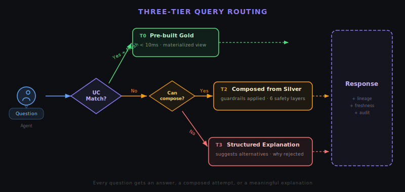
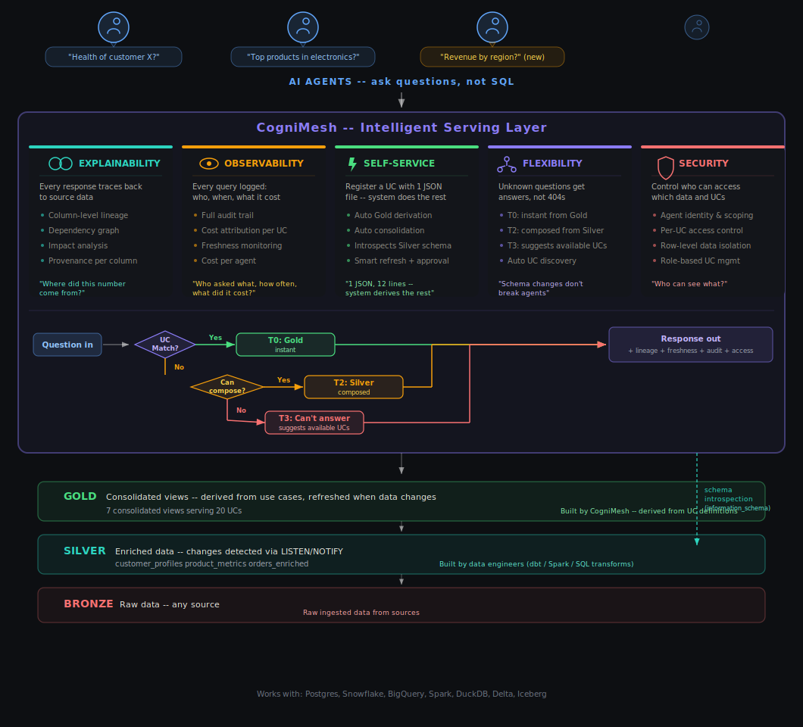

# CogniMesh

[](https://github.com/ShurikM/CogniMesh/actions/workflows/ci.yml)

<p align="center"></p>

### The governed data layer for AI agents.

---

## The Architectural Problem

Every team building AI agents hits the same wall: the agent needs data.

The default answer is REST endpoints. Someone writes a `/customer-health` endpoint, then `/top-products`, then `/revenue-by-region`. Each one is ~80 lines across multiple files. At 20 endpoints you have a maintenance problem. At 100, you have a platform problem. And every question the agent asks that you *didn't* pre-build returns a 404.

This is the wrong abstraction. You're encoding business questions as code, one at a time, with no shared infrastructure for the concerns that matter most: Where did this number come from? Is it fresh? Who accessed it? What happens when the schema changes?

---

## The Core Insight

**Register the question, not the endpoint.**

A Use Case in CogniMesh is a declaration of intent — a business question that an agent needs answered:

> *"What is the current health status of customer X?"*
> *"What are the best-selling products in category Y?"*
> *"What is the total revenue by region for the last 30 days?"*

From this declaration, CogniMesh derives everything else: the optimized data view, the lineage graph, the freshness contract, the access policy, and the audit trail. You define *what agents need to know*. The system figures out *how to serve it*.

This inversion matters because it moves intelligence from the endpoint layer (where it's duplicated per question) to the platform layer (where it's shared across all questions).

---

## Three-Tier Query Architecture

<p align="center"></p>

CogniMesh doesn't just serve pre-built answers. It handles the full spectrum of agent questions through a tiered routing system:

**Pre-built and fresh** — The question matches a registered Use Case and the data view is current. Serve directly. Sub-10ms. Every response carries column-level lineage (which source table and column produced each field) and freshness metadata (how old the data is, whether it's within the declared TTL).

**Unknown but answerable** — The question doesn't match any Use Case, but the system has enough metadata about the underlying tables to compose a safe query on the fly. Six layers of guardrails prevent expensive or dangerous operations: row limits, cost estimation, query plan analysis, table size checks, concurrency control, and execution timeouts. This is what REST *cannot* do — it turns 404s into governed, auditable answers.

**Cannot answer safely** — The question exceeds safety guardrails or the available metadata isn't sufficient. Instead of a silent failure, return a structured explanation: why the query was rejected, what was attempted, and which existing Use Cases might answer a related question.

The key architectural property: **no request goes unhandled.** Every question gets an answer, a composed attempt, or a meaningful explanation — and every interaction is audited regardless of which tier serves it.

---

## What the Platform Handles

These are the cross-cutting concerns that CogniMesh moves from per-endpoint responsibility to platform responsibility:

**Lineage.** Every field in every response is traceable to its source table and column. Not documentation — live metadata, queryable and verifiable.

**Freshness.** Every data view has a TTL contract. Every response reports the data age and whether it's stale. The platform refreshes only what's stale, not everything on a cron schedule.

**Audit.** Every query is logged: which agent, which question, which tier served it, how long it took, what it cost. Built-in cost attribution makes chargebacks possible without instrumentation.

**Governance.** Nothing in the serving layer changes without human approval. New questions, modified views, access policy changes — all go through a review queue before they take effect.

**Drift detection.** When upstream tables change structure, the platform detects it proactively via structural hashing — before queries start failing.

**View consolidation.** Overlapping Use Cases are automatically served by shared views. In our benchmark, 20 Use Cases are served by 4 views. The system derives the minimal set of materialized views needed, not one per question.

---

## Where It Fits

CogniMesh sits between your existing data pipeline and your agents:

<p align="center"></p>

**Connect mode** — Point CogniMesh at your existing Silver layer. It introspects the schema, derives optimized views from Use Case definitions, and starts serving. Your pipeline stays untouched. Start here.

**Manage mode** — CogniMesh manages the full pipeline from raw data through to agent-ready views, with lineage at every stage.

The serving layer must be a database optimized for point lookups — Postgres, DuckDB, StarRocks, or ClickHouse. Your source data can live anywhere.

---

## Evidence

We built two implementations of the same 20 business questions — one with a conventional dbt + REST stack, one with CogniMesh — and compared them on 8 architectural properties:

| Property | REST | CogniMesh |
|---|---|---|
| Agents can discover available data | Yes | Yes |
| Responses traceable to source | Yes | Yes |
| Queries audited | Yes | Yes |
| Cost attribution | Yes | Yes |
| Changes require approval | No | **Yes** |
| Freshness tracked in responses | Yes | Yes |
| Unknown questions handled | No | **Yes** |
| Schema drift detected proactively | No | **Yes** |

REST achieves 5 of 8. CogniMesh achieves 8 of 8. The three properties REST cannot match — change governance, graceful degradation for unknown questions, and proactive drift detection — are architectural, not incremental. You can't bolt them onto a REST stack without rebuilding the abstraction layer.

**Marginal cost:** Adding a new Use Case is 12 lines (1 JSON file). The REST equivalent is ~78 lines across 4 files. CogniMesh consolidated 20 Use Cases into 4 materialized views; the REST stack required 17 separate tables.

**Honest caveat:** This benchmark runs at toy scale — 10K rows, localhost, single node. It validates architectural properties, not production throughput. Full methodology: [docs/benchmark.md](docs/benchmark.md).

---

## Try It

```bash
git clone https://github.com/ShurikM/CogniMesh.git && cd CogniMesh
pip install -e ".[bench]"
docker compose up -d --wait && make seed && make setup-cognimesh
```

Run the benchmark: [docs/running-the-benchmark.md](docs/running-the-benchmark.md)

---

## Current State

**v0.1.0** — Architecture validated, not production-hardened.

90 tests. 8/8 system properties. Tiered query routing with safety guardrails. Column-level lineage. Freshness-aware smart refresh. Approval-based governance. MCP server for direct agent integration. Optional [schema intelligence](docs/dbook-integration.md) via dbook for richer metadata.

**What's next:** Usage-based intelligence (mine query logs to auto-promote ad-hoc questions into pre-built Use Cases) and semantic validation (natural-language rules that check whether results make business sense).

---

## Further Reading

- [Architecture and deployment details](docs/architecture.md)
- [Benchmark methodology and results](docs/benchmark.md)
- [Schema intelligence via dbook](docs/dbook-integration.md)
- [Governance and approval workflow](docs/approval-queue.md)

---

Apache 2.0 — see [LICENSE](LICENSE).
